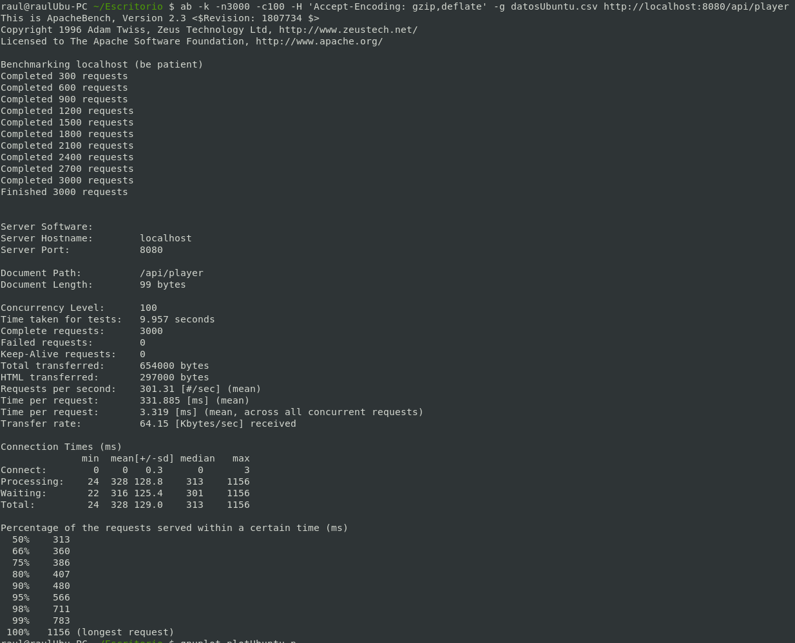
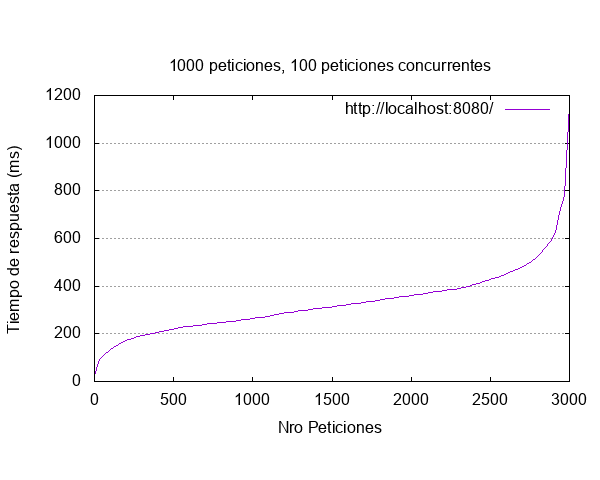
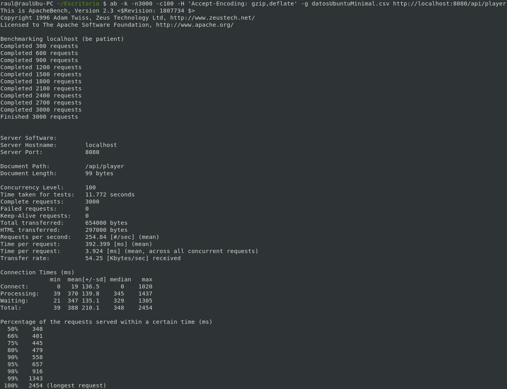
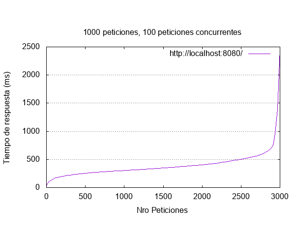

# Configuración Vagrant y Ansible. Despliegue en local.
Todos los pasos siguientes se han realizado previamente habiendo hecho la instalación de Vagrant, Ansible y Virtual Box en local. He seguido una guía de [Adictos al trabajo](https://www.adictosaltrabajo.com/) concretamente [Creación de entornos de integración con Ansible y Vagrant](https://www.adictosaltrabajo.com/2015/09/04/creacion-de-entornos-de-integracion-con-ansible-y-vagrant/) para la realización de configuración e instalación de todos los requisitos correspondientes al procedimiento aquí expresado, además primero hago unas pruebas para saber que box de Vagrant he elegido inicialmente para realizar todo el procedimiento, procedimiento que será explicado después de dichas pruebas, pero que en la realidad ha sido realizado antes. Destacar finalmente que el Vagrantfile realizado y el Playbook para Ansible es el mismo para ambas versiones de Ubuntu que he usado para las pruebas, simplemente ha sido cambiada la distribuación.

### ¿Como he elegido la Vagrant Box?
Lo primero que hay que realizar para la creación de un sistema virtualizado y provisionado automáticamente es la elección de una **box** con el sistema operativo que se vaya a utilizar, no puedo probar muchas versiones de diferentes distribuciones por que eso llevaría mucho tiempo, pero si me he permitido el coger dos distribuciones similares, he realizado su respectivo provisionado y ejecución del servicio **Padel Manager**, una vez levantado he usado [Apache Benchmark](https://httpd.apache.org/docs/2.4/programs/ab.html) para realizar peticiones contra ambas máquinas para ver como es su reacción, destacar que ambas pruebas han sido realizadas en las mismas condiciones, se ha instalado lo mismo, es decir, se ha usado el mismo **Playbook** simplemente cambiando la distribución usada, además ambas máquinas corrian solas, es decir, que cuando una estaba funcionando la otra no lo estaba por si los recursos de la máquina HOST puedan inferir en los resultados.

Una vez tenemos todo esto en cuenta, las dos distribuciones usadas son **Ubuntu 14.04 (ubuntu/trusty64)** que es la box más descargada de **Vagrant Cloud** y **Ubuntu 16.04.2 Minimal (minimal/xenial64)** destacar como minimal una versión que suele incluir los justo para operar, es más pequeña que sus superiores, lo que a priori nos puede hacer ver que la versión mínima vaya a dar los mejores resultado, pero que a continuación comprobaremos con las respectivas pruebas.

Como ya he dicho anteriormente las pruebas han sido realizadas con ambas máquinas, en las mismas condiciones y envíando 3000 peticiones con una concurrencia de 300, concretamente con la siguiente orden:

```
ab -k -n3000 -c100 -H 'Accept-Encoding: gzip,deflate' -g datos.csv http://localhost:8080/api/player
```

Para hacer uso de este benchmark he seguido la guía de [Apache Benchmark + GNUPlot: Medir y graficar el rendimiento de tu servidor web](https://blog.desdelinux.net/apache-benchmark-gnuplot-medir-rendimiento-de-servidor-web/) en los que los parámetros pasados significan:
1. -n: Número de peticiones enviadas.
2. -c: Concurrencia de dichas peticiones.
3. -k -H 'Accept-Encoding: gzip,deflate': Cito "Con esto ab aceptará el caché y compresión que el servidor tenga configurado, por lo que los tiempos serán inferiores.".
4. -g: El fichero con los resultados

Teniendo en cuenta esto, dejo capturas de los resultados y del procedimiento realizado:
##### Pruebas con Ubuntu 14.04



##### Pruebas con Ubuntu 16.04.2 Minimal



Una vez tenemos los resultados se ve claramente como mínimamente la distribución 14.04 de Ubuntu sale ganando frente a la versión Minimal de Ubuntu 16.04.2. Si nos fijamos cuando llegamos a 2500 peticiones el tiempo de respuesta en Minimal es de 500ms en cambio para 14.04 podemos observar que que es poco más de 400ms, esto es bastante evidente, lo que nos hace decantarnos por hacer uso de Ubuntu 14.04. Esto puede deberse a que Ubuntu 16.04 haga uso de más servicios en segundo plano por ser más nueva o que simplemente Ubuntu 14.04 está más probada y usada que esta versión más nueva. Definitivamente, la imagen box que he usado es Ubuntu 14.04.

### Configuración de Vagrant. Vagrantfile.
Una vez elegida la box que voy a usar, hay que configurar Vagrant para que este descargue la box correspondiente y toda la configuración relativa a la máquina que se va a crear así como su provisionamiento con Ansible. Lo primero que realicé es la creación de una carpeta donde voy a realizar todas las configuraciones de Vagrant y de Ansible correspondientes a la máquina final generada, esta se encuentra en la raíz del repositorio, justo en el directorio **despliegue**, dentro de ese directorio realizamos:
```
vagrant init
```
Esto generará un fichero con nombre **Vagrantfile** que es el fichero que generará la máquina que vamos a construir durante todo el procedimiento (procedimiento que repito ha sido realizado haciendo uso de la guía de [Adictos al trabajo](https://www.adictosaltrabajo.com/2015/09/04/creacion-de-entornos-de-integracion-con-ansible-y-vagrant/)). El **Vagrantfile** que he realizado tiene la siguiente configuración:
```
Vagrant.configure("2") do |config|
  config.vm.box = "ubuntu/trusty64"

  config.vm.network "forwarded_port", guest: 22, host:2222, id: "ssh", auto_correct: true

  config.vm.network "forwarded_port", guest: 8080, host:8080, id: "apache", auto_correct: true

  config.vm.define "ubuntu_config" do |ubuntu_config|
    ubuntu_config.vm.provision "ansible" do |ansible|
      ansible.inventory_path = "ansible/environments/ubuntu_config/inventory"
      ansible.playbook = "ansible/playbook.yml"
    end

    config.vm.provider "virtualbox" do |v|
      v.memory = 2048
    end
  end
end
```

Ahora voy a explicar el significado del fichero:
* ```Vagrant.configure("2") do |config|```: El 2 hace referencia a la versión del objeto de configuración que se usará para configurar todo el bloque que viene a continuación. Ref. [Configuration Version](https://www.vagrantup.com/docs/vagrantfile/version.html)
* ```config.vm.box = "ubuntu/trusty64"```: Indicación a Vagrant del box que utilizará para crear la máquina. Ref. [Machine Settings](https://www.vagrantup.com/docs/vagrantfile/machine_settings.html)
* ```config.vm.network "forwarded_port", guest: 22, host:2222, id: "ssh", auto_correct: true```: Mapeamos todas las peticiones que en el host se realicen al puerto 2222 vayan al puerto 22 de la máquina generada por Vagrant, básicamente esto nos permitirá acceder por ssh desde fuera de la máquina. Ref. [Machine Settings](https://www.vagrantup.com/docs/vagrantfile/machine_settings.html)
* ```config.vm.network "forwarded_port", guest: 8080, host:8080, id: "apache", auto_correct: true```: Mapeamos todas las peticiones que en el host se realicen al puerto 8080 vayan al puerto 8080 de la máquina generada por Vagrant, básicamente esto nos permitirá que cuando accedamos a la API REST con puerto 8080 desde local puedan enviarse dicha petición al 8080 de la máquina. Ref. [Machine Settings](https://www.vagrantup.com/docs/vagrantfile/machine_settings.html)
* ```config.vm.define "ubuntu_config" do |ubuntu_config|```: Esta sentencia sirve para especificar un entorno dentro de la máquina de configuración, por que Vagrant permite configurar varias máquinas con el mismo Vagrantfile, pues con esto definimos un entorno para una máquina concreta y todas las propiedades que pongamos dentro de esta se referirán a la máquina correspondiente. Ref. [Multi-Machine](https://www.vagrantup.com/docs/multi-machine/)
* ```ubuntu_config.vm.provision "ansible" do |ansible|```: Dentro de este entorno decimos que el encargado de instalar todos los paquetes, softwares... necesarios, será realizado por Ansible. Ref. [Vagrant Guide](https://docs.ansible.com/ansible/latest/scenario_guides/guide_vagrant.html)

* ```ansible.inventory_path = "ansible/environments/ubuntu_config/inventory"```: Le paso como parámetros donde se encuentra el directorio **inventory**. En este directorio se indican los grupos que tiene Ansible, así como las ip que están dentro de cada uno de ellos. Ref. [Shared Ansible Options](https://www.vagrantup.com/docs/provisioning/ansible_common.html)

* ```ansible.playbook = "ansible/playbook.yml"```: Se le pasa como parámetro donde se encuentra el fichero que Ansible usa para realizar todos los pasos correspondientes, así como en los grupos en los que va a realizarlos (expuestos en el inventory). Ref. [Ansible Pr  ovisioner](https://www.vagrantup.com/docs/provisioning/ansible.html)

* ```config.vm.provider "virtualbox" do |v|```: Configuramos la máquina para que se le ofrezca una cantida de memoria de 2GB concretamente ya que usamos la sentencia ```v.memory = 2048```. Ref. [VBoxManage Customizations](https://www.vagrantup.com/docs/virtualbox/configuration.html)

Con esto finalizamos la configuración del fichero de Vagrant que es el que se va a ejecutar cuando levantemos la máquina, este descargará el box correspondiente, configurará los puertos, creará el entorno dentro de la máquina y ejecutará en ella los ficheros de Ansible (que explicaremos a continuación) en los que se configurarán la instalación de los diferentes paquetes y aplicaciones dentro de la máquina.

### Configuración de Ansible
La estructura de directorios para Ansible que he optado por usar es la que proponen en [Creación de entornos de integración con Ansible y Vagrant](https://www.adictosaltrabajo.com/2015/09/04/creacion-de-entornos-de-integracion-con-ansible-y-vagrant/), es decir, hacer uso de un fichero con variables que vaya a usar en la configuración del estilo URLs, usuarios... un fichero inventory, que es lo que ya se ha adelantado anteriormente, para poder decirle a Ansible que máquina debe ejecutar dicho Playbook. Vagrant puede generar dicho fichero automáticamente, pero yo he optado por realizarlo manualmente y luego una serie de directorios con los diferentes roles que vamos a configurar, podríamos realizar las tareas directamente en el Playbook, pero de esta forma cada tarea será un rol y cada rol se enfocará en dicha tarea y no en un único fichero donde tener un cumulo de tareas que es más dificil de mantener. Teniendo en cuenta la estructura teorica, adjunto como queda finalmente:

```
despliegue/
├── ansible
│   ├── environments
│   │   └── ubuntu_config
│   │       ├── group_vars
│   │       │   └── uc
│   │       └── inventory
│   ├── playbook.yml
│   └── roles
│       ├── common_os_setup
│       │   └── tasks
│       │       └── main.yml
│       ├── dependencies
│       │   └── tasks
│       │       └── main.yml
│       ├── java11
│       │   └── tasks
│       │       └── main.yml
│       ├── maven
│       │   └── tasks
│       │       └── main.yml
│       ├── mysql
│       │   ├── handlers
│       │   │   └── main.yml
│       │   └── tasks
│       │       └── main.yml
│       └── padelmanager
│           └── tasks
│               └── main.yml
└── Vagrantfile
```

Como vemos tenemos un directorio con todos los roles y dentro de este un directorio para tareas y el fichero YML respectivo, dentro de esta puede haber otros tipos de directorios como handlers, templates o files que como no me hacen falta para este problema no los he generado. Luego tenemos el propio playbook donde llamaremos a los diferentes roles y finalmente tenemos un directorio environments donde tendremos un fichero con variables "uc" y el inventory que he explicado antes.

#### Explicación del fichero inventory
El fichero inventory como ya bien he dicho antes, es un fichero donde se exponen las máquinas que vamos a usar y se agrupan, asignandolas a un nombre de grupo que luego será usado para que el playbook sea aplicado al grupo correspondiente, en este caso se genera la máquina con ip la de localhost y con puerto ssh el 2222, que no es más que el puerto al que redireccionamos el 22 anteriormente en el Vagrantfile. Entre parentesis tenemos el grupo de máquinas al que se le aplicará un playbook determinado y dentro de este se añaden las máquinas que queremos aplicarles dicho playbook, en este caso solo tenemos una máquina luego la añadimos a dicho grupo al que le aplicaremos el playbook explicado más adelante.

```
ubuntu_config ansible_ssh_host=127.0.0.1 ansible_ssh_port=2222

[uc]
ubuntu_config
```

#### Explicación del fichero de variables
Este fichero lo he generado para facilitar el mantenimiento de variables usadas durante las diferentes tareas del playbook, a estas variables se pueden acceder realizando en las tareas de los diferentes roles como {{variable.subvariable}} un ejemplo sería {{github_repository.download_url}} para conseguir la URL de clonación del repositorio.
```
maven:
  download_url: http://ftp.cixug.es/apache/maven/maven-3/3.6.3/binaries/apache-maven-3.6.3-bin.tar.gz
  file: apache-maven-3.6.3-bin.tar.gz
  home: /opt/apache-maven-3.6.3

github_repository:
  download_url: https://github.com/ruanete/PadelManager.git
  home: /home/vagrant/PadelManager/padelmanager

mysql:
  db_name: PadelManager
  db_user: root
  db_pass: '*81F5E21E35407D884A6CD4A731AEBFB6AF209E1B'
```

#### Explicación del Playbook
El playbook no es más que un fichero en el que se añaden todas las tareas que tiene que realizar Ansible para provisionar la máquina, instalando y configurando toda la máquina con las tareas correspondientes. El fichero playbook que he generado es el siguiente:

```
- hosts: uc
  become: true
  gather_facts: no
  roles:
     - common_os_setup
     - dependencies
     - java11
     - maven
     - mysql
     - padelmanager
```

El significado del fichero es el siguiente:
* ```hosts: uc```: Esta sentencia indica en que máquinas van a ejecutarse dicho playbook, teniendo en cuenta que "uc" es el valor del grupo de máquinas que tendremos definido en el inventory.
* ```become: true```: Esto da permisos de superusuario para la instalación de todos los paquetes y de todas las dependencias.
* ```gather_facts: no```: Información de los sistemas remotos ofrecida por el gather_facts, en nuestros caso como no nos comunicamos con ningun sistema remoto lo deshabilitamos.
* ```roles```: Como ya he explicado anteriormente van a ser cada una de las tareas asignadas a cada rol que serán ejecutadas. Dichas tareas pueden ir en este fichero, pero creo que es conveniente hacerlo de esta forma para poder facilitar el mantenimiento de las mismas.

#### Explicación de los diferentes roles
##### Common_os_setup
Con estas tareas lo que realizamos es primero una actualización de paquetes, es como realizar el comando ```sudo apt-get update```, la segunda tarea realiza el comando upgrade de ubuntu y finalmente copiamos la clave pública de la máquina host donde se ejecuta la máquina con Vagrant para poder conectarnos por SSH desde la máquina HOST. Ref [Why can't I copy SSH keys to Vagrant VM?](https://stackoverflow.com/questions/34756702/why-cant-i-copy-ssh-keys-to-vagrant-vm)
```
- name: Asegurar de que la caché de APT esté actualizada
  apt: update_cache=yes

- name: Asegurar que los paquetes de APT se actualicen
  apt: upgrade=yes

- name: Copiar clave publica del host a la máquina
  authorized_key: user=vagrant key="{{  lookup('file', lookup('env','HOME') + '/.ssh/id_rsa.pub') }}"
```

##### Dependencies
En este rol se instalarían todas las dependencias generales usadas, en este caso solo nos hace falta git para poder clonar el repositorio con el proyecto y así poder ejecutarlo. Es sencillo, se llama a apt con el nombre del paquete "git" se descargará y se instalará.

```
- name: Instalar Git
  apt: name=git state=present
  tags: git

```

##### Java 11
En este rol se realiza la instalación de Java, concretamente del OpenJDK 11, para ello primero se installa "add-apt-repostory" para poder agregar repositorios, luego se añade el repositorio donde se descargará la versión de OpenJDK concretamente del repositorio "openjdk-r/ppa", realizamos el "update" con APT y finalmente si instala el OpenJDK 11.

```
- name: Install add-apt-repostory
  apt: name=software-properties-common state=latest

- name: Añadir repositorio de OpenJDK a los fuentes
  apt_repository: repo='ppa:openjdk-r/ppa'
  tags: java

- name: Actualización de la cache de paquetes APT
  apt: update_cache=yes
  tags: java

- name: Instalación de Java 11
  apt: name=openjdk-11-jdk state=latest install_recommends=yes
  tags: java
```

##### Maven
En este rol simplemente se realiza la instalación de Maven, destacar, que se intentó realizar la instalación con la versión más actualizada sin hacer uso del repositorio de APT, si no descargandolo de la web oficial, pero luego cuando se levantaba el servicio de PadelManager no funcionaba correctamente y la unica solución que pude realizar es instalar Maven desde APT.
```
- name: Instalación de Maven
  apt: name=maven state=latest
```

##### MySQL
Este rol va a realizar la instalación de MySQL, seguidamente creará una base de datos para que el servicio PadelManager pueda usarla, concretamente creará la base de datos con nombre "PadelManager" y finalmente se crea un usuario para la base de datos, dicho nombre de usuario y contraseña (cifrada) se encuentra en el fichero de variables anteriormente explicado. Para dicho usuario se le dan permisos para realizar cualquier tipo de procedimiento tanto crear, borrar o editar en la base de datos.
```
- name: Instalación de MySQL
  apt:
    name: ['mysql-server','mysql-client','python-mysqldb']
    state: latest

- name: Creación de la base de datos de PadelManager
  mysql_db:
    name: '{{ mysql.db_name }}'
    state: present

- name: Creación de usuario para la base de datos
  mysql_user:
    name: '{{ mysql.db_user }}'
    password: '{{ mysql.db_pass }}'
    encrypted: yes
    priv: '*.*:ALL,GRANT'
    state: present
```

##### PadelManager
En este rol finalmente se clona el repositorio de PadelManager, se compila el proyecto con maven, destacar la sentencia "chdir" que lo que hace es antes de realizar la orden de "shell" se mueve a dicho directorio que es donde se encuentra el proyecto, finalmente el proyecto es ejecutado en segundo plano. Cabe destacar que he tenido que usar la orden "nohup" de ubuntu que ejecuta el comando que lleva a continuación sin poder pararlo una vez haya comenzado ya que tenía problemas a ejecutarlo solamente en background y es la única forma que pude conseguir que funcionará correctamente.

```
- name: Clonar repositorio del proyecto PadelManager
  command: git clone {{github_repository.download_url}}

- name: Compilación del proyecto PadelManager
  become: yes
  shell: mvn clean install -DskipTests
  args:
    chdir: /home/vagrant/PadelManager/padelmanager

- name: Ejecución del servicio PadelManager
  become: yes
  shell: nohup mvn spring-boot:start &
  args:
    chdir: /home/vagrant/PadelManager/padelmanager
```

### Despliegue de la máquina final en local
Finalmente una vez configurado todo para generar la máquina y hacer uso de ella tan solo debemos dirigirnos al directorio ```despliegue``` y realizar el comando:

```
vagrant up
```

Con esto se levantará la máquina y Ansible realizará todo el provisionado de la misma, al final podremos acceder a la REST API tal y como haciamos antes haciendo peticiones a localhost en el puerto 8080.

#### Bibliografía
1. [Minimal Ubuntu: la imagen más pequeña está lista para automatizar la nube](https://www.muylinux.com/2018/07/10/minimal-ubuntu-imagen-pequena-automatizar-nube/)
2. [Creación de entornos de integración con Ansible y Vagrant](https://www.adictosaltrabajo.com/2015/09/04/creacion-de-entornos-de-integracion-con-ansible-y-vagrant/)
3. [Apache Benchmark + GNUPlot: Medir y graficar el rendimiento de tu servidor web](https://blog.desdelinux.net/apache-benchmark-gnuplot-medir-rendimiento-de-servidor-web/)
4. [Configuration Version](https://www.vagrantup.com/docs/vagrantfile/version.html)
5. [Machine Settings](https://www.vagrantup.com/docs/vagrantfile/machine_settings.html)
6. [Configuration Version](https://www.vagrantup.com/docs/vagrantfile/version.html)
7. [Machine Settings](https://www.vagrantup.com/docs/vagrantfile/machine_settings.html)
8. [Multi-Machine](https://www.vagrantup.com/docs/multi-machine/)
9. [Vagrant Guide](https://docs.ansible.com/ansible/latest/scenario_guides/guide_vagrant.html)
10. [Shared Ansible Options](https://www.vagrantup.com/docs/provisioning/ansible_common.html)
11. [Ansible Provisioner](https://www.vagrantup.com/docs/provisioning/ansible.html)
12. [VBoxManage Customizations](https://www.vagrantup.com/docs/virtualbox/configuration.html)
13. [Why can't I copy SSH keys to Vagrant VM?](https://stackoverflow.com/questions/34756702/why-cant-i-copy-ssh-keys-to-vagrant-vm)
14. [Setting up MySQL root user with Ansible and Vagrant](http://www.inanzzz.com/index.php/post/xk3y/setting-up-mysql-root-user-with-ansible-and-vagrant)
15. [¿QUÉ ES EL COMANDO NOHUP Y CÓMO USARLO?](https://maslinux.es/que-es-el-comando-nohup-y-como-usarlo/)
